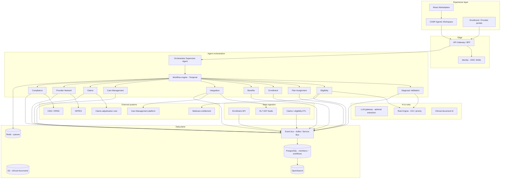
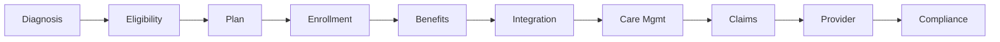
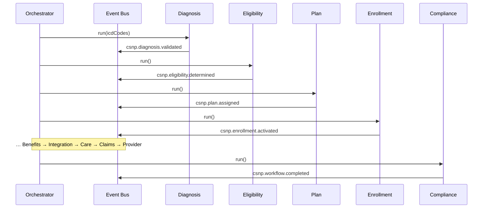

# CSNP Agentic System — Complete Flow (Medicare Advantage)

This document describes the **end-to-end Chronic Condition Special Needs Plan (CSNP)** lifecycle implemented in the Healthcare AI Agent Marketplace under **Government Programs**. It covers the **CSNP Intelligence Agent** hub (orchestrator + 10 lifecycle agents), event-driven handoffs, ICD-10 eligibility rules, the **reference member portfolio**, and production architecture.

**Operators:** For how to open the workspace, navigate the five tabs, and read AI intervention outcomes (live feed, event bus, toasts, next-step hints), start at **§4 User navigation — viewing AI intervention outcomes**.

**Implementation references**

| Artifact | Path |
|----------|------|
| Marketplace workspace | `src/components/agents/CSNPIntelligenceWorkspace.jsx` |
| Live activity stream | `src/components/agents/CSNPAgentActivityStream.jsx` |
| Live event bus UI | `src/components/agents/CSNPEventBusStream.jsx` |
| Agent pipeline & reference data | `src/data/csnpAgentData.js` |
| Orchestration logic | `src/lib/csnpOrchestrator.js` |
| Member clinical portfolio | `src/data/csnpData.js` |
| Marketplace card | `src/pages/AgentMarketplace.jsx` → `csnp-intelligence` |
| Catalog entry | `src/data/agents.js` (category `government_programs`) |

---

## Production implementation — technical specification

The CSNP solution is a **production-grade, multi-tier, event-driven agentic system**: marketplace UI, API gateway, Temporal workflow orchestration, ten specialized lifecycle agents, Kafka/Azure Service Bus events, rule engine, and CMS-compliant audit storage.

### System capabilities

| Capability | Implementation |
|------------|----------------|
| **Eligibility** | ICD-10 → chronic condition map + Drools/YAML rule engine |
| **Plan assignment** | Priority rules when multiple chronic conditions |
| **Enrollment** | Effective / retro dates; reject when diagnosis missing |
| **Benefits** | Plan- and condition-specific copay, deductible, coverage |
| **Care management** | Case, care manager, ADT & care-gap triggers |
| **Claims** | CSNP adjudication; benefits & authorization rules |
| **Provider** | NPPES validation, PCP assignment, referrals |
| **Compliance** | CMS MOC/SNP rules, audit logs, HPMS reporting |
| **Orchestration** | Supervisor agent — retries, state consistency |
| **Events** | Kafka / Azure Service Bus — replay & idempotency |
| **Auth** | SSO (OIDC/SAML), RBAC per agent function |
| **PHI** | HIPAA encryption, BAA-covered cloud |

---

### Reference architecture



---

### 1. Experience layer (marketplace UI)

| Item | Specification |
|------|----------------|
| **Framework** | React 18.3 + MUI 6 — `CSNPIntelligenceWorkspace.jsx` |
| **Build** | Vite 6; GitHub Actions CI |
| **Styling** | Emotion + `compactTheme` for dense agent console |
| **Entry point** | Single marketplace card: **CSNP Intelligence Agent** |
| **Tabs** | Orchestrator · Agent console (live activity stream) · Event bus (animated live stream) · Test scenarios · Member 360 |
| **Components** | `CSNPAgentActivityStream.jsx`, `CSNPEventBusStream.jsx` |
| **Data** | Workflow Service API + synchronized `workflows` client state |
| **Real-time** | WebSocket/SSE for orchestrator progress & event stream |
| **Auth** | Roles: `csnp-enrollment`, `csnp-care`, `csnp-claims`, `csnp-compliance` |
| **Loading** | `React.lazy` + `Suspense` for workspace bundle |

**Marketplace module layout**

```text
src/
├── components/agents/CSNPIntelligenceWorkspace.jsx
├── data/csnpAgentData.js          # Pipeline, ICD map, plans, events
├── data/csnpData.js               # CSNP_MEMBERS, plan metadata
├── lib/csnpOrchestrator.js        # Agent + orchestrator execution
└── pages/AgentMarketplace.jsx     # Opens workspace on csnp-intelligence
```

| Pattern | Implementation |
|---------|----------------|
| **One hub, ten agents** | Orchestrator runs pipeline; Agent console executes single agent |
| **Shared workflow store** | `workflows[]` keyed by `memberId` |
| **Event log** | Each agent appends to `workflow.events[]` |
| **Notifications** | Green success / red error toasts |
| **Test harness** | `TEST_SCENARIOS` → `applyTestScenario()` |

---

### 2. API & backend services

| Service | Responsibility | Stack |
|---------|----------------|-------|
| **BFF** | Aggregate member workflow, events, agent console | FastAPI / NestJS |
| **Member workflow service** | CRUD lifecycle state, stage transitions | PostgreSQL |
| **Enrollment service** | Effective / retro dates, rejections | PostgreSQL + rules |
| **Benefits service** | Plan-specific benefit packages | PostgreSQL + config |
| **Integration service** | HL7 ADT + REST to care management | MuleSoft / custom adapters |
| **Claims adapter** | CSNP adjudication rules | Claims core API |
| **Compliance service** | CMS audit artifacts, HPMS extracts | S3 + PostgreSQL |
| **Event relay** | Outbox → Kafka / Service Bus | Transactional outbox |

**REST mapping (marketplace operation → API)**

| UI operation | API (example) |
|--------------|-----------------|
| Run full lifecycle | `POST /v1/members/{id}/workflow/run` |
| Single orchestrator step | `POST /v1/members/{id}/workflow/step` |
| Execute agent | `POST /v1/members/{id}/agents/{agentType}/run` |
| List workflows | `GET /v1/workflows?stage=eligibility` |
| Get event stream | `GET /v1/members/{id}/events` |
| Run test scenario | `POST /v1/test-scenarios/{scenarioId}/run` |
| Create enrollment | `POST /v1/members` + ICD codes |
| Validate diagnosis | `POST /v1/members/{id}/diagnosis/validate` |

---

### 3. Agent orchestration

#### 3.1 Orchestrator (Supervisor Agent)

| Responsibility | Detail |
|----------------|--------|
| Workflow control | Advances `stage` through `CSNP_PIPELINE_STAGES` |
| Failure handling | Routes failed enrollments to Compliance for audit |
| Retries | Integration agent retries ≤3 with backoff |
| Idempotency | `idempotencyKey` = `{memberId}-{eventType}` |
| State consistency | Single `member_workflow` row per member |

```text
DisputeLifecycleWorkflow(memberId):
  FOR each stage IN [diagnosis → … → compliance]:
    INVOKE agent(worker)
    PUBLISH event TO bus
    IF failed: INVOKE compliance; HALT
    WAIT human approval IF policy.requires_hitl(stage)
```

#### 3.2 Lifecycle agents (summary)

| Agent | Autonomous | Human gate | Key integration |
|-------|------------|------------|-----------------|
| Diagnosis Validation | ICD map, reject missing | Analyst review edge cases | Clinical feed |
| Eligibility | Rule engine | Appeals queue | HETS |
| Plan Assignment | Priority table | Override form | Plan config DB |
| Enrollment | Activate dates | Retro approval | Enrollment system |
| Benefits | Copay/deductible | Actuary exceptions | Benefits engine |
| Integration | HL7/REST push | Ops on 3 failures | Care management |
| Care Management | Case + ICP | CM supervisor | ADT feeds |
| Claims | CSNP adjudication | Denial analyst | Claims core |
| Provider Network | NPI check | Network committee | NPPES |
| Compliance | CMS rule pack | Compliance officer | HPMS |

#### 3.3 LLM usage (bounded)

| Use case | Guardrail |
|----------|-----------|
| Clinical note → ICD suggestion | Human confirms before Diagnosis agent |
| Care plan narrative | No PHI in model logs |
| **Not LLM** | Eligibility pass/fail, plan priority | Rule engine only |

---

### 4. Data ingestion

| Channel | Pattern | Consumer |
|---------|---------|----------|
| Enrollment API | `POST /ingest/enrollment` | Diagnosis agent |
| HL7 ADT | Hospital admit/discharge | Care Management agent |
| Claims batch | Nightly 837/835 | Claims agent |
| Eligibility file | CMS/HETS sync | Eligibility agent |
| Analyst UI | Marketplace forms | Orchestrator |

```text
Landing → validate → match/create memberId → emit csnp.member.received → start workflow
```

---

### 5. Storage & data model

#### PostgreSQL (primary)

| Table | Purpose |
|-------|---------|
| `member_workflows` | Stage, status, plan, enrollment, flags |
| `workflow_events` | Append-only event log |
| `benefits_packages` | Plan-versioned benefits |
| `care_cases` | CM case linkage |
| `compliance_audits` | CMS audit IDs |
| `agent_runs` | Idempotency, input/output hash |

#### Event bus

Topic: `csnp.lifecycle` — all `EVENT_TYPES` from `csnpAgentData.js`.

---

### 6. Integrations

| System | Agent | Pattern |
|--------|-------|---------|
| Care Management | Integration, Care | REST + HL7 v2.5 ADT |
| Claims core | Claims | REST adjudication |
| NPPES | Provider Network | Cached REST |
| CMS HPMS | Compliance | Batch SFTP |
| Medicare entitlement | Eligibility | HETS |

---

### 7. Security & operations

HIPAA encryption (KMS), RBAC, immutable audit trail, OpenTelemetry traces, EKS deployment, Terraform IaC.

---

### 8. Implementation rollout phases

| Phase | Deliverable |
|-------|-------------|
| 1 | Workflow API + PostgreSQL; marketplace loads from API |
| 2 | Temporal orchestrator + event bus |
| 3 | Diagnosis, Eligibility, Plan agents + rule engine |
| 4 | Enrollment, Benefits, Integration (HL7) |
| 5 | Care, Claims, Provider agents |
| 6 | Compliance reporting + analytics warehouse |

---

### 9. Technology stack summary

| Layer | Technology |
|-------|------------|
| UI | React 18, MUI 6, Vite |
| API | FastAPI or NestJS |
| Workflow | Temporal.io |
| Agents | Worker services + `csnpOrchestrator.js` logic |
| Events | Kafka or Azure Service Bus |
| Rules | Drools / YAML (`ICD_CHRONIC_MAP`) |
| DB | PostgreSQL (Aurora) |
| Cache | Redis |
| Observability | Datadog / OpenTelemetry |

---

## 1. Executive overview

CSNP plans serve Medicare Advantage members with **severe or disabling chronic conditions**. The marketplace **CSNP Intelligence Agent** implements a **modular, event-driven, multi-agent architecture** where each lifecycle stage is an independent intelligent agent supervised by an **Orchestrator Agent**.



| Order | Agent | Stage key | Primary purpose |
|------:|-------|-----------|-----------------|
| — | **Orchestrator** | — | Supervisor — workflow, retries, consistency |
| 1 | **Diagnosis Validation** | `diagnosis` | ICD-10 → chronic condition |
| 2 | **Eligibility** | `eligibility` | Rule engine eligibility |
| 3 | **Plan Assignment** | `plan` | CSNP plan + priority rules |
| 4 | **Enrollment** | `enrollment` | Activate / retro dates |
| 5 | **Benefits** | `benefits` | Copay, coverage, deductible |
| 6 | **Integration** | `integration` | Care management connectivity |
| 7 | **Care Management** | `care` | Case, manager, care plan |
| 8 | **Claims** | `claims` | CSNP adjudication |
| 9 | **Provider Network** | `provider` | NPI, PCP, referrals |
| 10 | **Compliance** | `compliance` | CMS audit & reporting |

**Category color (UI):** `#FF9500` (amber gradient header).

---

## 2. Marketplace integration

### Opening the workspace

1. User expands **Government Programs** on the Agent Marketplace.
2. Clicks **CSNP Intelligence Agent** (`type: csnp-intelligence`).
3. `CSNPIntelligenceWorkspace` opens (lazy-loaded).
4. Workflow state initializes from `INITIAL_WORKFLOWS` in `csnpAgentData.js`.

### Shared workflow memory

- All tabs read/write the same `workflows[]` array.
- **Orchestrator** tab runs full lifecycle or single step.
- **Agent console** runs one agent against the selected member workflow.
- **Event bus** tab shows a **live animated stream** plus persisted `workflow.events` for the selected member (`CSNPEventBusStream.jsx`).

### Core business rules

| # | Rule | Enforcement agent |
|---|------|-------------------|
| 1 | Eligible only with valid ICD-10 → chronic map | Diagnosis + Eligibility |
| 2 | Missing diagnosis → **reject enrollment** | Diagnosis Validation |
| 3 | Multiple conditions → **priority rules** for plan | Plan Assignment |
| 4 | Benefits are plan- and condition-specific | Benefits |
| 5 | Care management on enrollment, ADT, care gaps | Care Management |
| 6 | Claims use CSNP rules — avoid incorrect denials | Claims |
| 7 | CMS compliance + audit logs | Compliance |

### Agent console — live activity stream

The **Agent console** tab includes a real-time activity panel (terminal-style, Framer Motion animations):

| UI element | Behavior |
|------------|----------|
| **LIVE** pulse indicator | Green dot + amber border glow while agents run |
| **Shimmer progress bar** | Top bar during execution |
| **Step feed** | Each orchestration step slides in; spins while running, checkmark on success |
| **Monospace log** | Timestamp + agent name per line; auto-scroll to latest |
| **Clear log** | Reset feed between runs |

Activity scripts are defined in `AGENT_ACTIVITY_STEPS` (`csnpAgentData.js`) — e.g. ICD validation, HETS eligibility, HL7 integration ACK.

Running **Execute agent**, **Run full lifecycle** (from Orchestrator), or **Test scenarios** switches to Agent console and streams activities before applying workflow results. Use **View Event bus** (Agent console) or the **Event bus** tab to watch `csnp.*` events publish in parallel.

### Event bus — live stream

Component: `CSNPEventBusStream.jsx` (Framer Motion). Merges persisted `workflow.events` with live publishes during runs.

| UI element | Behavior |
|------------|----------|
| **LIVE** chip + purple border glow | Events streaming from current agent run |
| **Consuming…** + partition chips | Visual Kafka / Service Bus consumer model |
| **Flow particles & scan line** | Motion while `live === true` |
| **Event cards** | Slide-in; newest card pulses; color by event type (success / error / info) |
| **Payload / idempotency** | Monospace JSON + idempotency key per card |

Events are emitted when activity steps include `Publishing event → <type>` (see `AGENT_ACTIVITY_STEPS`). Failed runs may append rejection events (e.g. `csnp.diagnosis.rejected`).

**Operator guide:** See **§4 User navigation — viewing AI intervention outcomes** for full tab-by-tab walkthrough.

---

### Notifications & next-step guidance

After each orchestrator or agent action, the workspace shows:

1. **Inline alert** (green / red) under Orchestrator and Agent console tabs — e.g. *“Next: open the Agent console tab and run Eligibility Agent for M-10891.”*
2. **Open agent** button — switches to Agent console with the correct agent pre-selected.
3. **Toast** — short confirmation plus next agent name when applicable.

| Severity | When |
|----------|------|
| Green | Lifecycle complete, agent success, scenario pass, next-step hint |
| Red | Missing ICD, rejection, validation failure |
| Info | Banner: follow next-step messages after each action |

---

## 3. Workspace shell

```
┌──────────────────────────────────────────────────────────────┐
│ Header: CSNP Agentic System · plan contract · Production     │
├──────────────────────────────────────────────────────────────┤
│ KPIs: Completed | In progress | Rejected | Events published │
│ 10-step lifecycle stepper (read-only progress)               │
├──────────────────────────────────────────────────────────────┤
│ Tabs: Orchestrator | Agent console + LIVE feed | Event bus | Tests | 360 │
├──────────────────────────────────────────────────────────────┤
│ Tab content: member list · live feeds · animated event bus   │
└──────────────────────────────────────────────────────────────┘
│ Fixed toast (green / red)                                    │
└──────────────────────────────────────────────────────────────┘
```

**Portfolio KPIs**

| KPI | Calculation |
|-----|-------------|
| Completed lifecycles | `workflow.completed === true` |
| In progress | Not completed and not failed |
| Rejected / failed | `workflow.failed === true` |
| Events published | Sum of `workflow.events.length` |

---

## 4. User navigation — viewing AI intervention outcomes

This section is the **operator guide** for the marketplace workspace: where to click, which tab to use, and how to read the results of each AI agent run.

### 4.1 Open the workspace

| Step | Action | What you see |
|------|--------|--------------|
| 1 | Open the **Healthcare AI Agent Marketplace** (local dev or GitHub Pages `/HealthCareAgents/`) | Category grid |
| 2 | Expand **Government Programs** (amber `#FF9500`) | CSNP Intelligence Agent card |
| 3 | Click **CSNP Intelligence Agent** | Full-screen dialog: **CSNP Agentic System** |
| 4 | (Optional) Close with **X** in the header | Returns to marketplace |

The dialog loads reference workflows from `INITIAL_WORKFLOWS` (e.g. Maria Rodriguez `M-10482`, James Chen `M-10891`).

### 4.2 Layout at a glance

```text
┌─ Header: CSNP Agentic System · plan name · Production ─────────────┐
├─ KPI row: Completed | In progress | Rejected | Events published ───┤
├─ Info banner: follow "Next step" after each action ──────────────┤
├─ 10-step lifecycle stepper (current stage for selected member) ──┤
├─ Tabs: Orchestrator | Agent console | Event bus | Test scenarios | Member 360
├─ Tab content (member-scoped) ────────────────────────────────────┤
└─ Toast (bottom center): green success / red error ─────────────────┘
```

**Member selection** drives every tab: pick a workflow in **Orchestrator** (left list) or **Member 360** → **Select workflow**. All outcomes below apply to the **selected** `memberId`.

### 4.3 Five tabs — what each shows

| Tab | Primary use | Where AI outcomes appear |
|-----|-------------|---------------------------|
| **Orchestrator** | Run full lifecycle or one supervisor step; create new enrollment | Member card **status chip**; **stage** line; red **rejection** alert; **Next step** alert; lifecycle **stepper** advances |
| **Agent console** | Run one of the 10 agents; watch live execution | **Live activity stream** (terminal feed); agent dropdown + **completed agents** table; **Next step** + **Open agent** |
| **Event bus** | Audit asynchronous handoffs (Kafka / Service Bus) | Animated **event cards** (`csnp.*` types), partition chips, **LIVE** while streaming |
| **Test scenarios** | Run packaged regression cases | Same as lifecycle: auto-opens **Agent console**, then toast + persisted workflow |
| **Member 360** | Clinical portfolio reference | ICD/MBI/enrollment; **Select workflow** jumps to Orchestrator with that member |

### 4.4 How to run AI interventions (four paths)

| Path | Tab | Button | Auto tab switch | Outcome applied to |
|------|-----|--------|-----------------|---------------------|
| **Full lifecycle** | Orchestrator | **Run full lifecycle** | → Agent console | All 10 agents in order; `workflow.completed` or `workflow.failed` |
| **Single orchestrator step** | Orchestrator | **Single orchestrator step** | → Agent console | Current stage agent only; may halt on failure |
| **Single agent** | Agent console | **Execute agent** | Stays on Agent console | Selected agent from dropdown |
| **Test scenario** | Test scenarios | **Run** (per row) | → Agent console | `applyTestScenario()` — member on scenario row |

**New enrollment:** Orchestrator → enter ICD-10 codes (e.g. `I50.9, E11.9`) → **Create workflow** → follow **Next step** to Diagnosis Validation or run full lifecycle.

While any run is in progress, buttons show a spinner and **LIVE** indicators appear on the Agent console and Event bus.

### 4.5 Where to read outcomes (outcome map)

Use this table after every run to confirm what the AI decided:

| Outcome type | Location | Success signal | Failure signal |
|--------------|----------|----------------|----------------|
| **Workflow status** | Orchestrator member list chip | Green/warning “In progress” → completed status | Red **Rejected** / failed chip |
| **Business decision** | Orchestrator detail panel | Plan name, stage advances, no red alert | Red `Alert`: `rejectionReason` (e.g. missing diagnosis) |
| **Pipeline position** | Top **stepper** (all tabs) | Step checkmarks through Compliance | Step stops at failed stage |
| **Portfolio metrics** | KPI row (header) | **Completed lifecycles** ↑ | **Rejected / failed** ↑ |
| **Agent-level trace** | Agent console → **live feed** | Green checkmarks per step | Red error line in feed |
| **Per-agent completion** | Agent console → agents table | Row highlights as agents finish | Failed agent implied by feed + workflow |
| **Event audit** | **Event bus** tab | Green-tinted cards (`validated`, `completed`, `activated`, …) | Red-tinted cards (`rejected`, `failed`, `denied`) |
| **Guided next action** | Green/red **Next step** alert + **Open agent** | Names next agent (e.g. Eligibility) | Tells you to fix ICD or review rejection |
| **Transient feedback** | Bottom **toast** | Green: success + “See Event bus” on scenarios | Red: validation / scenario failure |
| **Persisted events** | Event bus (after run ends) | Full `workflow.events[]` history | Fail events e.g. `csnp.diagnosis.rejected` |

**Example — happy path (Maria `M-10482`):** After **Run full lifecycle**, stepper reaches Compliance; chip shows completed status; Event bus lists ten `csnp.*` events ending in `csnp.workflow.completed`; KPI **Completed lifecycles** increments.

**Example — rejection (`missing-diagnosis` scenario):** Feed shows Diagnosis Validation error; Orchestrator shows red rejection text; Event bus shows rejection event; **Next step** stays on Diagnosis or prompts fix; toast is **red**.

### 4.6 Agent console — live activity stream

Component: `CSNPAgentActivityStream.jsx`. Steps come from `AGENT_ACTIVITY_STEPS` in `csnpAgentData.js`.

| UI element | Meaning |
|------------|---------|
| **LIVE** pulse + amber border | Agents are executing |
| Shimmer **progress bar** | Run in progress |
| **Spinning icon** | Current step running |
| **Checkmark** | Step succeeded |
| Timestamps + agent name | Audit-style trace |
| **Clear log** | Reset feed (disabled while LIVE) |
| **View Event bus** | Switches to Event bus tab (pulses during LIVE) |

During **Run full lifecycle**, **Execute agent**, or **Test scenarios**, the workspace **automatically switches to Agent console** so you see the stream before persisted workflow state updates.

### 4.7 Event bus — live event stream

Component: `CSNPEventBusStream.jsx`. Topic: **`csnp.lifecycle`**.

| UI element | Meaning |
|------------|---------|
| **LIVE** chip + purple glow border | Events streaming from current run |
| **Consuming…** chip | Bus is receiving agent publishes |
| **Partition-0/1/2** pulsing | Kafka-style consumer groups (visual) |
| **Flowing particles / scan line** | Active pipeline animation |
| **Event cards** (newest on top) | `type`, timestamp, JSON `payload`, `idempotencyKey` |
| Card color | Green = success milestones; red = rejections; blue = determinations; purple = default |

**How events appear during a run:** Each agent activity step that says `Publishing event → csnp.<domain>.<action>` adds a card in real time. After the run finishes, live events merge into `workflow.events` (live buffer clears ~800ms later).

**Navigation tip:** Click **View Event bus** on Agent console during a run, or open the **Event bus** tab after completion to verify handoffs match the activity feed.

### 4.8 Notifications and next-step guidance

| Channel | When | What to do |
|---------|------|------------|
| **Info banner** (top) | Always | Read before first run — follow **Next step** messages |
| **Next step** alert (green) | Agent succeeded, lifecycle incomplete | Click **Open agent** or go to Agent console with suggested agent |
| **Next step** alert (red) | Rejection or validation failure | Fix ICD/input; re-run Diagnosis or Eligibility |
| **Toast** (bottom) | Action complete | Green = proceed; red = blocked — read message |

### 4.9 Recommended navigation flows

**A — First-time demo (complete member)**

1. **Orchestrator** → select **Maria Rodriguez** (`M-10482`).
2. **Run full lifecycle** → watch **Agent console** feed.
3. **View Event bus** or **Event bus** tab → confirm ten events.
4. Check KPI **Completed lifecycles** and green **Next step** / completed chip.

**B — Step-by-step (operations training)**

1. **Orchestrator** → select **James Chen** (`M-10891`).
2. **Agent console** → **Eligibility Agent** → **Execute agent**.
3. Read feed + **Next step** → run **Plan Assignment**, then continue per hints.
4. Cross-check each publish on **Event bus**.

**C — Failure / compliance path**

1. **Test scenarios** → **missing-diagnosis** → **Run**.
2. **Agent console** (auto) → red step in feed.
3. **Orchestrator** → red rejection alert.
4. **Event bus** → rejection event card.

**D — New member**

1. **Member 360** or **Orchestrator** → **Create workflow** with ICD codes.
2. **Agent console** → **Diagnosis Validation** → **Execute agent**.
3. Follow green **Next step** through lifecycle or use **Run full lifecycle**.

### 4.10 Quick reference — buttons → outcomes

| Button | Expected AI outcome (success) | Where to verify |
|--------|------------------------------|-----------------|
| **Run full lifecycle** | `completed: true`, `status` reflects full pipeline | Stepper, chip, Event bus `csnp.workflow.completed` |
| **Single orchestrator step** | One stage advanced | `stage` field, stepper index, one new event |
| **Execute agent** | Fields updated for that agent (plan, benefits, case ID, etc.) | Orchestrator detail + Event bus event for that agent |
| **Run** (test scenario) | Scenario-specific pass/fail | Toast + scenario name; workflow matches `TEST_SCENARIOS` |
| **Create workflow** | New row in member list | Select member → run Diagnosis |

---

## 5. End-to-end happy path

**Member:** Maria Rodriguez (`M-10482`) · **ICD-10:** `I50.9`, `E11.9`

| Step | Agent | Action / result | Event |
|-----:|-------|-----------------|-------|
| 1 | Diagnosis Validation | CHF validated (primary) | `csnp.diagnosis.validated` |
| 2 | Eligibility | Eligible | `csnp.eligibility.determined` |
| 3 | Plan Assignment | **CSNP-CHF-2026** (priority 1 over DM) | `csnp.plan.assigned` |
| 4 | Enrollment | Active 2024-01-01 | `csnp.enrollment.activated` |
| 5 | Benefits | PCP $0, CHF bundle | `csnp.benefits.configured` |
| 6 | Integration | CM-10482 HL7+REST | `csnp.integration.sent` |
| 7 | Care Management | CASE-10482, Lisa Tran | `csnp.care.case_created` |
| 8 | Claims | Paid $120 | `csnp.claim.adjudicated` |
| 9 | Provider Network | PCP validated | `csnp.provider.validated` |
| 10 | Compliance | CMS pass | `csnp.workflow.completed` |

**UI:** Orchestrator tab → select Maria → **Run full lifecycle** (or resume from mid-pipeline).

---

## 6. Agent 1 — Diagnosis Validation Agent

**Type:** `diagnosis-validation`  
**Input:** Member, `icdCodes[]`  
**Output:** `validatedCondition` | `rejectionReason`

### Logic (`runDiagnosisValidationAgent`)

| Condition | Result |
|-----------|--------|
| `icdCodes` empty | **Reject** — `MISSING_ICD` |
| No mapping in `ICD_CHRONIC_MAP` | **Reject** — non-chronic |
| Valid mapping | `stage → eligibility`, primary = lowest `priority` value |

### Validations (red toast)

- Missing ICD on new enrollment workflow

---

## 7. Agent 2 — Eligibility Agent

**Type:** `eligibility`  
**Responsibilities:** Map ICD → condition → eligibility via rule engine

| Outcome | Next stage |
|---------|------------|
| Eligible | `plan` |
| Ineligible | `failed`, enrollment rejected |

Publishes `csnp.eligibility.determined` or `csnp.enrollment.rejected`.

---

## 8. Agent 3 — Plan Assignment Agent

**Type:** `plan-assignment`  
**Responsibilities:** Assign CSNP plan; **multiple conditions → priority rules**

| ICD | Condition | Plan ID | Priority |
|-----|-----------|---------|----------|
| I50.9 | CHF | CSNP-CHF-2026 | 1 (highest) |
| N18.6 | ESRD | CSNP-ESRD-2026 | 1 |
| E11.9 | Diabetes | CSNP-DM-2026 | 2 |
| J44.9 | COPD | CSNP-COPD-2026 | 3 |
| F33.1 | MDD | CSNP-BH-2026 | 3 |
| I10 | Hypertension | CSNP-CVD-2026 | 4 |

**Example:** `I50.9` + `E11.9` → **CSNP-CHF-2026** wins.

---

## 9. Agent 4 — Enrollment Agent

**Type:** `enrollment`  
**Responsibilities:** Activate enrollment; effective dates; **retro dates**

| Field | Value |
|-------|-------|
| `enrollment.status` | `Active` |
| `enrollment.effectiveDate` | `retroDate` or today |
| `enrollment.retro` | boolean |

Blocked if prior agents set `failed: true`.

---

## 10. Agent 5 — Benefits Agent

**Type:** `benefits`  
**Responsibilities:** Plan-specific + condition-specific benefits

Loads `CSNP_PLANS[assignedPlanId]`:

| Plan | PCP copay | Coverage highlight |
|------|-----------|------------------|
| CSNP-CHF-2026 | $0 | CHF model of care |
| CSNP-DM-2026 | $0 | DM supplies + MTM |
| CSNP-COPD-2026 | $0 | Pulmonary rehab |
| CSNP-ESRD-2026 | $0 | Dialysis coordination |
| CSNP-BH-2026 | $0 | BH visits + CM |

---

## 11. Agent 6 — Integration Agent

**Type:** `integration`  
**Responsibilities:** Care management systems — **API + HL7**

| Outcome | Event |
|---------|-------|
| Success | `csnp.integration.sent` → `stage: care` |
| Failure (&lt;3 attempts) | `csnp.integration.failed` → retry |
| Failure (3+) | Halt; ops alert |

Test scenario `integration-failure` exercises retry path.

---

## 12. Agent 7 — Care Management Agent

**Type:** `care-management`  
**Responsibilities:** Create case, assign manager, care plan, triggers

| Trigger | Action |
|---------|--------|
| Enrollment | Open case + ICP |
| ADT (hospitalization) | Escalate care plan |
| Care gaps | Outreach task |

| Output field | Example |
|--------------|---------|
| `careCase.caseId` | CASE-10482 |
| `careCase.manager` | Lisa Tran |
| `careCase.planId` | ICP-2026-042 |

Failure publishes `csnp.care.trigger_failed` + re-trigger alert.

---

## 13. Agent 8 — Claims Agent

**Type:** `claims`  
**Responsibilities:** CSNP adjudication; pricing; benefits; authorization

| Check | Denial root cause |
|-------|-------------------|
| Benefits not configured | `BENEFITS_MISSING` |
| CSNP rules pass | Paid |

Publishes `csnp.claim.adjudicated` or `csnp.claim.denied`.

---

## 14. Agent 9 — Provider Network Agent

**Type:** `provider-network`  
**Responsibilities:** Provider eligibility, referrals, PCP assignment

| Output | Value |
|--------|-------|
| `provider.pcpValid` | true/false |
| `provider.npi` | validated NPI |
| `provider.pcpAssigned` | true |

---

## 15. Agent 10 — Compliance Agent

**Type:** `compliance`  
**Responsibilities:** CMS rules, audit logs, reporting

| Path | Result |
|------|--------|
| Workflow success | `compliance.cmsPass: true`, `csnp.workflow.completed` |
| Workflow failed | Audit rejection, `csnp.workflow.failed` |

CMS checks: chronic verification, MOC, ICP, PCP attestation window, HPMS reporting.

---

## 16. Orchestrator Agent (Supervisor)

**Functions:** `runOrchestratorStep`, `runFullLifecycle` in `csnpOrchestrator.js`

| UI control | Behavior |
|------------|----------|
| **Run full lifecycle** | Executes agents in order until complete or failed |
| **Single orchestrator step** | One agent + advance stage |

On failure (except diagnosis-only): invokes Compliance agent for audit trail.

---

## 17. Workflow stage reference

| `stage` key | Agent type | Typical status |
|-------------|------------|----------------|
| `diagnosis` | diagnosis-validation | Pending Diagnosis Validation |
| `eligibility` | eligibility | Eligibility Review |
| `plan` | plan-assignment | Plan Assigned |
| `enrollment` | enrollment | Enrolled |
| `benefits` | benefits | Benefits Configured |
| `integration` | integration | Integrated with Care Management |
| `care` | care-management | Care Plan Active |
| `claims` | claims | Claim Adjudicated |
| `provider` | provider-network | Provider Validated |
| `compliance` | compliance | CMS Compliant — Lifecycle complete |

---

## 18. Member workflow data model

```typescript
interface MemberWorkflow {
  memberId: string;
  memberName: string;
  mbi: string;
  stage: string;
  status: string;
  icdCodes: string[];
  validatedCondition: string | null;
  rejectionReason: string | null;
  assignedPlanId: string | null;
  assignedPlanName: string | null;
  eligibilityResult: 'Eligible' | 'Ineligible' | null;
  enrollment: { status: string; effectiveDate: string; retro: boolean } | null;
  benefits: { configured: boolean; copay?: object; coverage?: string } | null;
  integration: { status: string; attempts: number; externalId?: string };
  careCase: { caseId: string; manager: string; planId: string } | null;
  claim: { status: string; amount?: number; rootCause?: string } | null;
  provider: { pcpValid: boolean; npi: string; pcpAssigned?: boolean } | null;
  compliance: { cmsPass: boolean; auditId: string } | null;
  retroDate: string | null;
  events: Array<{ type: string; at: string; payload?: object; idempotencyKey?: string }>;
  lastAgent: string | null;
  completed: boolean;
  failed: boolean;
}
```

---

## 19. Reference member portfolio

### Workflow seeds (`INITIAL_WORKFLOWS`)

#### M-10482 — Maria Rodriguez (mid/complete pipeline)

| Attribute | Value |
|-----------|-------|
| Stage | `care` / Care Management Active |
| ICD | I50.9, E11.9 |
| Plan | CSNP-CHF-2026 |
| Completed lifecycle | Yes (also usable as reference for full run) |
| **Primary workspace** | Orchestrator — resume or Agent console |

#### M-10891 — James Chen (eligibility)

| Attribute | Value |
|-----------|-------|
| Stage | `eligibility` / Eligibility Review |
| ICD | J44.9 (COPD validated) |
| Plan | Not yet assigned |
| **Primary workspace** | Eligibility or Plan Assignment agent |

### Clinical portfolio (`CSNP_MEMBERS` in `csnpData.js`)

| Member | ID | Conditions | Enrollment |
|--------|-----|------------|------------|
| Maria Rodriguez | M-10482 | CHF, DM | Active |
| James Chen | M-10891 | COPD (unverified) | Pending Verification |
| Patricia Williams | M-10234 | ESRD, HTN | Active |
| William Foster | M-11102 | MDD, DM | Active |

**Plan metadata:** `CSNP_PLAN` — Summit Health CSNP 2026, contract H1234-001, MOC v4.2.

---

## 20. Test scenarios

| ID | Name | Expected |
|----|------|----------|
| `missing-diagnosis` | No ICD | Reject at diagnosis |
| `multi-condition` | I50.9 + E11.9 | CSNP-CHF-2026 |
| `retro-eligibility` | retroDate 2026-04-01 | Backdated enrollment |
| `integration-failure` | HL7 timeout | Retry then complete |
| `claims-denial` | Benefits edge case | Deny + root cause |
| `care-trigger` | ADT failure | Alert + `care.trigger_failed` |
| `duplicate-member` | Duplicate MBI | Deduplication event |

**UI:** Test scenarios tab → **Run** per scenario.

---

## 21. Event schema (JSON)

**Envelope**

```json
{
  "eventId": "uuid",
  "eventType": "csnp.plan.assigned",
  "eventVersion": "1.0",
  "occurredAt": "2026-05-31T14:22:00Z",
  "correlationId": "workflow-M-10482",
  "idempotencyKey": "M-10482-csnp.plan.assigned",
  "producer": "plan-assignment-agent",
  "payload": { "memberId": "M-10482", "planId": "CSNP-CHF-2026", "priority": 1 }
}
```

| eventType | When |
|-----------|------|
| `csnp.diagnosis.validated` | ICD maps to chronic condition |
| `csnp.diagnosis.rejected` | Missing/invalid ICD |
| `csnp.eligibility.determined` | Rule engine pass |
| `csnp.plan.assigned` | Plan selected |
| `csnp.enrollment.activated` | Member active |
| `csnp.enrollment.rejected` | Ineligible |
| `csnp.benefits.configured` | Benefits loaded |
| `csnp.integration.sent` / `.failed` | CM integration |
| `csnp.care.case_created` / `.trigger_failed` | Care management |
| `csnp.claim.adjudicated` / `.denied` | Claims |
| `csnp.provider.validated` | Provider network |
| `csnp.compliance.passed` | CMS audit pass |
| `csnp.workflow.completed` / `.failed` | Terminal |

---

## 22. Error handling & data consistency

| Failure | Strategy |
|---------|----------|
| Missing diagnosis | Reject; no downstream agents; audit |
| Multi-condition | Deterministic priority sort |
| Integration timeout | Retry ≤3; exponential backoff |
| Care trigger failure | Alert + scheduled re-trigger |
| Claims denial | Root cause code to analyst queue |
| Duplicate MBI | Golden record merge event |
| Orchestrator crash | Temporal replay from last event |

| Principle | Implementation |
|-----------|----------------|
| Idempotency | `idempotencyKey` per agent invocation |
| No data loss | Outbox + at-least-once Kafka |
| Replay | Event log retention + workflow reset |
| Consistency | Single `member_workflows` source of truth |

---

## 23. Integration patterns (HL7 / API)

| Pattern | Detail |
|---------|--------|
| REST `POST /care-management/v1/members/{id}/sync` | Integration agent outbound |
| HL7 ADT^A01/A03 | Inbound → Care Management trigger |
| HETS | Eligibility entitlement check |
| Claims REST | Adjudication request/response |
| NPPES REST | Provider validation (24h cache) |
| HPMS SFTP | Compliance monthly batch |

---

## 24. Compliance validation logic

```text
cmsComplianceCheck(workflow):
  ASSERT workflow.validatedCondition OR workflow.failed
  ASSERT enrollment_active OR rejection_documented
  ASSERT care_plan_exists OR workflow.failed
  ASSERT audit_trail_complete(workflow.events)
  RETURN cmsPass
```

| Regulation | Check |
|------------|-------|
| 42 CFR § 422.504(f) | SNP compliance |
| CMS CSNP Guidance 2026 | Chronic condition verification |
| MOC § 4.3.2 | Individualized care plan |
| CMS HPMS | Monthly SNP reporting |

---

## 25. Visual depiction map

```
MARKETPLACE: Government Programs (#FF9500)
│
└── CSNP Intelligence Agent (hub)
    ├── Orchestrator ──────────► Member list · Run full lifecycle · Next step alerts
    │         └── Outcomes: status chip · stage · rejection · stepper
    ├── Agent console ─────────► LIVE feed · Execute agent · View Event bus
    │         └── Outcomes: step trace · completed agents table · Open agent
    ├── Event bus ─────────────► Animated csnp.lifecycle stream (LIVE + history)
    │         └── Outcomes: event cards · payloads · pass/fail colors
    ├── Test scenarios ────────► 7 cases → auto Agent console + toast
    └── Member 360 ────────────► Portfolio · Select workflow → Orchestrator
```

**See §4** for step-by-step navigation and outcome interpretation.

---

## 26. Operational walkthrough (~15 minutes)

Follow **§4** while executing these steps:

1. **Orchestrator** — Select James Chen (`M-10891`) → **Run full lifecycle** → watch **Agent console** LIVE feed → confirm plan **CSNP-COPD-2026** on Orchestrator and `csnp.plan.assigned` on **Event bus**.  
2. **Agent console** — New workflow → **Diagnosis Validation** → **Execute agent** → use green **Next step** / **Open agent** to run **Eligibility** only.  
3. **Test scenarios** — **missing-diagnosis** → **Run** → verify red feed line, red toast, red rejection on Orchestrator, rejection event on **Event bus**.  
4. **Test scenarios** — **multi-condition** on M-10482 → Event bus shows CHF priority plan assignment.  
5. **Event bus** — During a lifecycle run, click **View Event bus** and watch cards stream; after run, confirm count matches KPI **Events published**.  
6. **Member 360** — Review ICD list → **Select workflow** → **Create workflow** with new ICDs on Orchestrator if needed.

---

## 27. Agent catalog metadata

| ID | Name | Status | Business value |
|----|------|--------|----------------|
| `csnp-intelligence` | CSNP Intelligence Agent | stable | End-to-end CSNP automation with CMS compliance |

**Features (catalog):**

- Orchestrator supervisor agent  
- 10 specialized lifecycle agents  
- ICD-10 rule engine & plan priority  
- Event bus (Kafka / Service Bus) with live animated stream UI  
- HL7 & REST integrations  
- CMS audit & compliance reporting  

---

## Appendix A — Agent interaction sequence



---

## Appendix B — Pseudocode index

Full pseudocode for each agent is implemented in `src/lib/csnpOrchestrator.js`:

| Function | Agent |
|----------|-------|
| `runDiagnosisValidationAgent` | Diagnosis Validation |
| `runEligibilityAgent` | Eligibility |
| `runPlanAssignmentAgent` | Plan Assignment |
| `runEnrollmentAgent` | Enrollment |
| `runBenefitsAgent` | Benefits |
| `runIntegrationAgent` | Integration |
| `runCareManagementAgent` | Care Management |
| `runClaimsAgent` | Claims |
| `runProviderNetworkAgent` | Provider Network |
| `runComplianceAgent` | Compliance |
| `runOrchestratorStep` / `runFullLifecycle` | Orchestrator |
| `applyTestScenario` | Test harness |

---

*Document version aligns with production implementation in `CSNPIntelligenceWorkspace.jsx`, `CSNPAgentActivityStream.jsx`, `CSNPEventBusStream.jsx`, `csnpAgentData.js`, `csnpOrchestrator.js`, and `csnpData.js`.*
