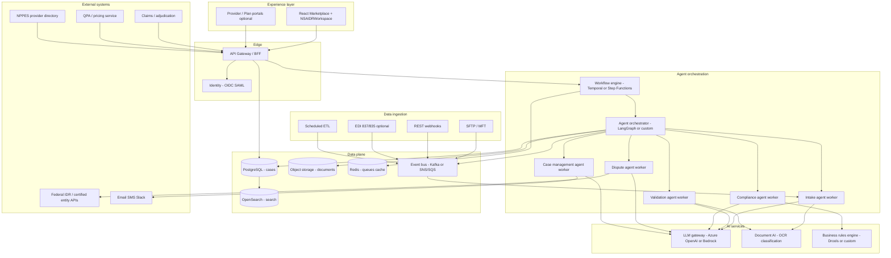
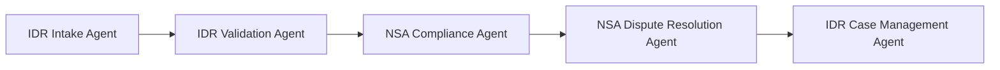
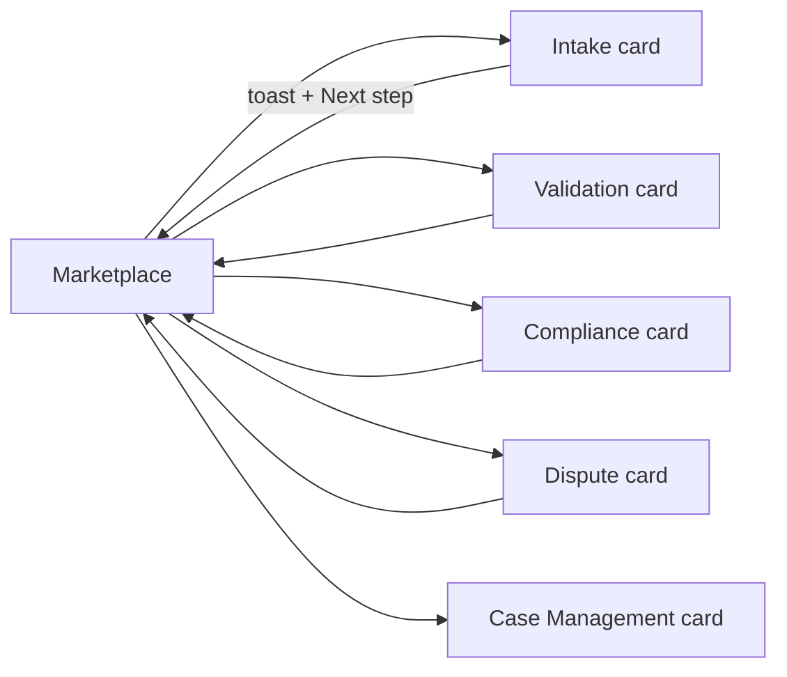

# No Surprises Act & IDR — Complete Flow (5 Agent Cards)

This document describes the **end-to-end Independent Dispute Resolution (IDR)** workflow implemented in the Healthcare AI Agent Marketplace for the **No Surprises Act & IDR** category. It covers all **five marketplace agent cards**, how they connect, shared case data, validation rules, and the **reference dispute portfolio** used in operations.

**Operators:** For how to open each agent card, move cases through the pipeline, and read AI intervention outcomes (work queue, stepper, toasts, next-step hints, timeline), start at **§4 User navigation — viewing AI intervention outcomes**.

**Implementation references**

| Artifact | Path |
|----------|------|
| Shared workspace (all 5 agents) | `src/components/agents/NSAIDRWorkspace.jsx` |
| Data & pipeline config | `src/data/nsaIdrData.js` |
| Marketplace cards & state | `src/pages/AgentMarketplace.jsx` |
| Agent catalog entries | `src/data/agents.js` (category `no_surprises_act`) |

---

## Production implementation — technical specification

The No Surprises Act & IDR solution is a **production-grade, multi-tier implementation**: marketplace experience (React), API gateway and case services, workflow-orchestrated agents, regulated ingestion and storage, and integrations with claims, QPA, and federal IDR channels. The five agent cards in `NSAIDRWorkspace.jsx` are the operational UI for analysts at each pipeline stage.

### System capabilities

| Capability | Implementation |
|------------|----------------|
| **Case state** | PostgreSQL dispute registry + immutable event log |
| **Documents** | S3 (KMS) + virus scan + OCR + metadata in PostgreSQL |
| **Agents** | Five orchestrated workers (intake, validation, compliance, dispute, case management) |
| **Handoffs** | Temporal workflows assign tasks; analysts continue via marketplace cards |
| **Compliance** | Versioned rules engine (R1–R6) + audit artifacts |
| **IDR submission** | Federal IDR / certified-entity APIs (where licensed) |
| **Auth** | SSO (OIDC/SAML), RBAC per agent queue |
| **PHI** | HIPAA controls, encryption at rest and in transit, BAA-covered cloud |

---

### Reference architecture



---

### 1. Experience layer (marketplace UI)

| Item | Specification |
|------|----------------|
| **Framework** | **React 18.3** + **MUI 6** marketplace (`AgentMarketplace.jsx`, `NSAIDRWorkspace.jsx`) |
| **Build** | **Vite 6** — production bundle to `dist/`; CI via GitHub Actions |
| **Styling** | Emotion + MUI `sx`; global theme `src/theme.js`; per-agent `compactTheme` for dense IDR workspaces |
| **Motion** | Framer Motion for category expand/collapse on marketplace |
| **Data fetching** | TanStack Query (or RTK Query) for case lists, document status, workflow tasks |
| **Real-time** | WebSocket or SSE for queue updates, agent run progress, stakeholder alerts |
| **Workspace** | `NSAIDRWorkspace` — BFF client mapped 1:1 to operations (`submitIntake`, `approveValidation`, `runComplianceAnalysis`, etc.) |
| **File upload** | Direct-to-S3 presigned URLs; progress UI; malware scan status polling |
| **Auth** | OIDC redirect; JWT in memory; role claims: `idr-intake-analyst`, `idr-validator`, `compliance-officer`, `dispute-specialist`, `case-manager` |
| **Code splitting** | `React.lazy` + `Suspense` for agent workspace bundles |

**UI runtime (marketplace module)**

| Layer | Technology | Role |
|-------|------------|------|
| React / react-dom | ^18.3.1 | Components, hooks, agent dialogs |
| MUI + Icons | ^6.4.0 | Tables, steppers, forms, alerts |
| Emotion | ^11.14.0 | CSS-in-JS for MUI |
| Grid2 | MUI 6 | Responsive agent layout |
| Framer Motion | ^11.18.0 | Marketplace animations |

**Marketplace module layout**

```text
src/
├── main.jsx                 # ThemeProvider + CssBaseline + ErrorBoundary
├── App.jsx                  # Layout → AgentMarketplace
├── theme.js                 # Global MUI theme
├── pages/
│   └── AgentMarketplace.jsx # Dispute portfolio state; lazy-loads agent workspaces
├── components/
│   ├── Layout.jsx           # App chrome / header chips
│   ├── ErrorBoundary.jsx    # Render error containment
│   └── agents/
│       └── NSAIDRWorkspace.jsx   # Five agents via agentType prop
└── data/
    ├── nsaIdrData.js        # Pipeline config, rules, reference portfolio
    └── agents.js            # Catalog (no_surprises_act category)
```

| Pattern | Implementation |
|---------|----------------|
| **Five agents, one workspace** | `agentType`: `idr-intake` \| `idr-validation` \| `nsa-compliance` \| `nsa-dispute-resolution` \| `idr-case-management` |
| **Shared case store** | Case Service API; marketplace synchronizes `nsaDisputes` client state across all five cards |
| **Async operations** | Workflow jobs (e.g. compliance analysis, federal IDR submit) with API polling or WebSocket progress |
| **Notifications** | MUI `Alert` toasts — green success (routing) / red error (validation) |
| **Language** | JavaScript (JSX) |

---

### 2. API & backend services

| Service | Responsibility | Suggested stack |
|---------|----------------|-----------------|
| **BFF (Backend for Frontend)** | Aggregate case + docs + tasks for each agent card; enforce RBAC | Node.js (Fastify/Nest) or Python (FastAPI) |
| **Case service** | CRUD disputes, stage transitions, timeline append-only | PostgreSQL + Prisma/SQLAlchemy |
| **Document service** | Upload metadata, versioning, retention, legal hold | S3 + PostgreSQL metadata |
| **Workflow service** | Pipeline state machine mirroring `PIPELINE_STAGES` | Temporal.io (preferred) or AWS Step Functions |
| **Notification service** | Stakeholder alerts from Case Management agent | SES + SNS or Twilio + templating |
| **Integration service** | Claims, QPA, NPPES lookups | Async adapters + circuit breakers |
| **Audit service** | Immutable audit log for CMS/regulatory review | Append-only table or audit stream to SIEM |

**REST mapping (marketplace operation → API)**

| UI operation | API (example) |
|-----------------|---------------------------|
| Submit intake | `POST /v1/disputes` + `POST /v1/disputes/{id}/documents` |
| Index document | `PATCH /v1/disputes/{id}/documents/{docId}` `{ received: true }` |
| Complete intake | `POST /v1/disputes/{id}/transitions` `{ targetStage: "validation" }` |
| Approve validation | `POST /v1/disputes/{id}/validation/approve` |
| Reject validation | `POST /v1/disputes/{id}/validation/reject` |
| Run compliance | `POST /v1/disputes/{id}/compliance/analyze` → async job |
| Submit federal IDR | `POST /v1/disputes/{id}/idr/submit` |
| Record arbitration | `POST /v1/disputes/{id}/arbitration/decision` |
| Close case | `POST /v1/disputes/{id}/close` |
| Work queue | `GET /v1/workqueues/{agentType}?status=open` |

---

### 3. Agent orchestration

Each marketplace card maps to a **registered agent** in an orchestration plane. Orchestration coordinates **deterministic rules**, **LLM-assisted steps**, and **human-in-the-loop (HITL)** approvals.

#### 3.1 Orchestration components

| Component | Role |
|-----------|------|
| **Workflow engine** | Owns case `stage`, timeouts (e.g. 30-day negotiation), retries, compensations |
| **Agent orchestrator** | Invokes the right agent for the current stage; passes case context + document embeddings |
| **Tool registry** | Typed tools agents may call: `lookup_npi`, `fetch_qpa`, `score_evidence`, `run_compliance_rules`, `submit_idr` |
| **Policy layer** | Max automation without human sign-off per stage; PHI redaction before LLM |
| **Human tasks** | Creates inbox items when score &lt; 80%, compliance Fail, or high-dollar disputes |

#### 3.2 Five agents — production responsibilities

| Agent | Autonomous (agent) | Human gate | Tools / integrations |
|-------|-------------------|------------|----------------------|
| **IDR Intake** | Classify submission channel; extract fields from PDFs; duplicate detection; NPI/TIN validation | Analyst confirms routing | OCR, NPPES, duplicate-case search |
| **IDR Validation** | Evidence checklist scoring; missing-doc detection; suggested rejection reason | Validator approves/rejects | Document AI, rules for required package |
| **NSA Compliance** | Run R1–R6 rules; QPA methodology check; negotiation timer | Officer reviews exceptions | Rules engine, QPA service, claims snapshot |
| **NSA Dispute Resolution** | Draft negotiation summaries; fee calculation estimates; IDR form prep | Specialist submits to federal IDR | IDR portal/API, offer history |
| **IDR Case Management** | Timeline enrichment; SLA alerts; closure checklist | Manager closes case | Notification hub, reporting warehouse |

#### 3.3 Suggested orchestration stack (pick one pattern)

| Pattern | Technologies | When to use |
|---------|--------------|-------------|
| **Workflow-first** | Temporal + Python/TypeScript workers | Long-running IDR cases, timers, federal waiting periods |
| **Agent-graph** | LangGraph / LangChain + tool calling | Heavy LLM reasoning with explicit state graph per stage |
| **Hybrid (recommended)** | Temporal for lifecycle + LangGraph per agent step | Production healthcare: durable workflow + bounded AI steps |

**Example workflow definition (conceptual):**

```text
DisputeLifecycleWorkflow(disputeId):
  1. INTAKE     → IntakeAgent.run → wait_signal(analyst_complete_intake)
  2. VALIDATION → ValidationAgent.run → wait_signal(approve | reject)
  3. COMPLIANCE → ComplianceAgent.run → if exceptions: wait_signal(officer_review)
  4. DISPUTE    → DisputeAgent.run → wait_signal(idr_submitted)
  5. CASE       → CaseManagementAgent.run → wait_signal(case_closed)
  on reject at validation: goto INTAKE
```

#### 3.4 LLM usage (bounded)

| Use case | Model task | Guardrails |
|----------|------------|------------|
| Document extraction | Parse IDR initiation, EOB, negotiation notice | Schema-validated JSON output; confidence thresholds |
| Summarization | Case timeline narrative for leadership | No PHI in logs; summarize in VPC |
| Rejection draft | Suggested letter from `REJECTION_REASONS` | Human edits before send |
| **Not LLM-only** | Compliance Pass/Fail for R1–R6 | **Rules engine** is source of truth; LLM explains only |

---

### 4. Data ingestion

| Channel | Source | Ingestion pattern | Lands in |
|---------|--------|-------------------|----------|
| **Provider portal** | Web upload (PDF, ZIP) | API → virus scan → S3 → event `document.received` | Intake queue |
| **SFTP / MFT** | Clearinghouse, vendor batch | Scheduled pull → checksum → decrypt PGP | Staging bucket → intake agent |
| **Email gateway** | Secure email (e.g. Proofpoint) | Parse attachment → case match or new case | Intake agent |
| **REST webhook** | Partner PMS / RCM | HMAC-signed `POST /ingest/idr-submission` | Case service |
| **Claims / EOB feed** | Core admin / 835 remittance | Batch ETL nightly | Links `memberId`, `billedAmount`, `planOffer` |
| **QPA feed** | Pricing actuary system | API on service date + CPT | Pre-fills `qpa`, `planOffer` |
| **Manual analyst** | Marketplace UI | Intake wizard & case actions | Case service API |

**Ingestion pipeline stages:**

```text
Raw landing (encrypted S3)
  → Metadata + virus scan (ClamAV / cloud AV)
  → OCR / classification (Document AI)
  → PHI tagging + retention class
  → Match or create disputeId
  → Emit dispute.intake.received → start Intake agent workflow
```

| Control | Requirement |
|---------|-------------|
| **Idempotency** | `Idempotency-Key` on ingest APIs; dedupe by provider + service date + amount hash |
| **Lineage** | `source_system`, `ingest_batch_id`, `original_filename` on every document |
| **Failures** | Dead-letter queue + ops dashboard; no silent drops |

---

### 5. Storage & data model

#### 5.1 Primary stores

| Store | Technology | Contents |
|-------|------------|----------|
| **Transactional DB** | PostgreSQL 15+ (RDS/Aurora) | `disputes`, `documents`, `timeline_events`, `compliance_results`, `arbitration`, `assignments` |
| **Object storage** | S3 (SSE-KMS) | PDFs, images, generated reports; lifecycle to Glacier |
| **Search** | OpenSearch | Full-text on notes, provider names, dispute IDs |
| **Cache** | Redis | Work queue slices, session, rate limits |
| **Event log** | Kafka or Kinesis | `dispute.stage.changed`, `agent.run.completed` for analytics |
| **Warehouse** | Snowflake / BigQuery (optional) | Portfolio KPIs, regulatory reporting |

#### 5.2 PostgreSQL schema (dispute model)

| Table | Key fields |
|-------|------------|
| `disputes` | `id`, `stage`, `status`, amounts, `member_id_hash`, `federal_idr_eligible`, `assigned_to` |
| `dispute_documents` | `dispute_id`, `doc_type`, `required`, `received_at`, `s3_key`, `ocr_payload_json` |
| `dispute_timeline` | `dispute_id`, `occurred_at`, `event`, `actor`, `correlation_id` |
| `compliance_runs` | `dispute_id`, `run_id`, `overall`, `rules_json`, `created_at` |
| `agent_runs` | `dispute_id`, `agent_type`, `status`, `input_hash`, `output_json`, `model_version` |
| `workflow_instances` | `dispute_id`, `workflow_id`, `current_step`, `temporal_run_id` |

All PHI fields: encrypt at rest (KMS); mask in non-prod; **no PHI in agent prompt logs**.

#### 5.3 Reference portfolio (`INITIAL_DISPUTES`)

The operational portfolio loads four reference disputes from configuration (`INITIAL_DISPUTES` in `nsaIdrData.js`), persisted in PostgreSQL as `disputes` + related rows. Dropdowns, rule definitions, and pipeline metadata are served from the config service or versioned DB migrations.

---

### 6. Integrations (external systems)

| System | Purpose | Integration style |
|--------|---------|-------------------|
| **Claims / adjudication** | Verify service, allowed amounts, member eligibility | REST or HL7 FHIR Claim |
| **QPA / pricing** | Qualified payment amount per interim final rule | Internal pricing API |
| **NPPES** | Validate NPI, provider legal name | CMS NPPES API (cached) |
| **Federal IDR** | Submit initiation, fees, entity selection | Certified entity API / portal automation (RPA fallback) |
| **Document management** | Enterprise CMIS if required | Optional connector |
| **SIEM / audit** | Splunk, Datadog, CloudTrail | All API + agent actions |

---

### 7. Security, compliance, and operations

| Area | Specification |
|------|----------------|
| **HIPAA** | BAA with cloud provider; minimum-necessary PHI; access logging |
| **Encryption** | TLS 1.2+ in transit; KMS at rest; field-level encryption for `member_id` |
| **IAM** | RBAC per agent queue; break-glass role for supervisors |
| **Audit** | Every stage transition + agent run + human approval → immutable audit trail |
| **Retention** | Legal hold on disputes; document retention per policy (e.g. 7 years) |
| **Observability** | OpenTelemetry traces across BFF → workflow → agent; metrics per stage SLA |
| **Deployment** | Containers on EKS/AKS; GitHub Actions → staging → prod; IaC (Terraform) |
| **Secrets** | AWS Secrets Manager / Azure Key Vault for API keys and LLM credentials |

---

### 8. Deployment topology (example)

| Environment | Components |
|-------------|------------|
| **Dev** | Docker Compose: Postgres + Redis + sandbox integrations; local Temporal |
| **Staging** | Single-region AWS: ECS/EKS, anonymized synthetic data |
| **Production** | Multi-AZ, autoscaling BFF + workers, read replicas, cross-region backup for S3/DB |

**CI/CD (extends current GitHub Actions):**

```text
PR → lint/test → build React → build API images → deploy staging
main → integration tests → deploy prod (manual approval gate)
```

---

### 9. Implementation rollout phases

| Phase | Deliverable | UI impact |
|-------|-------------|-----------|
| **Phase 1** | Case + document APIs; Postgres; S3 uploads | Marketplace loads portfolio from Case Service |
| **Phase 2** | Workflow engine + work queues | Sidebar loads from `GET /workqueues/{agentType}` |
| **Phase 3** | Intake/validation agents (OCR + scoring) | “Index document” triggers async OCR job |
| **Phase 4** | Compliance rules engine + QPA integration | “Run analysis” → async job + stored `compliance_runs` |
| **Phase 5** | IDR submission + case management notifications | Federal IDR + email/Slack alerts |
| **Phase 6** | LLM summarization + analytics warehouse | Executive reporting and case narratives |

The **five marketplace cards and pipeline order remain fixed** across all phases; each phase deepens backend orchestration behind the same analyst UX.

---

### 10. Technology stack summary

| Layer | Recommended technology |
|-------|------------------------|
| Frontend | React 18, MUI 6, TanStack Query, Vite |
| API | FastAPI (Python) or NestJS (TypeScript) |
| Workflow | Temporal.io |
| Agent framework | LangGraph + tool registry (Python) |
| LLM gateway | Azure OpenAI or AWS Bedrock (private endpoint) |
| OCR | Azure Document Intelligence or AWS Textract |
| Rules | Drools or custom YAML rule packs versioned in Git |
| Database | PostgreSQL (Aurora) |
| Documents | Amazon S3 + KMS |
| Events | Amazon EventBridge + SQS, or Kafka |
| Search | OpenSearch |
| Cache | Redis (ElastiCache) |
| Auth | Okta / Azure AD (OIDC) |
| IaC | Terraform |
| Observability | Datadog or Grafana stack (Prometheus, Loki, Tempo) |

*Teams may substitute GCP/Azure equivalents; the **architectural boundaries** (BFF, workflow, agents, ingestion, storage) should remain stable.*

---

## 1. Executive overview

The No Surprises Act (NSA) limits surprise medical billing for out-of-network (OON) care. When open negotiation between a plan and provider fails, parties may enter **federal Independent Dispute Resolution (IDR)**.

The marketplace exposes **five separate agent widgets**—each is its own card. They share one **dispute case store** (`nsaDisputes` in the marketplace). A case progresses through pipeline stages; the user **closes one agent dialog and opens the next card** on the marketplace (no in-dialog agent switching).



| Order | Agent card | Pipeline stage key | Primary purpose |
|------:|------------|-------------------|-----------------|
| 1 | **IDR Intake Agent** | `intake` | Receive/index provider submissions & documents |
| 2 | **IDR Validation Agent** | `validation` | Evidence completeness & approve/reject |
| 3 | **NSA Compliance Agent** | `compliance` | NSA applicability & regulatory rule checks |
| 4 | **NSA Dispute Resolution Agent** | `dispute` | Open negotiation log, federal IDR submission, arbitration outcome |
| 5 | **IDR Case Management Agent** | `case` | Timeline, portfolio view, alerts, case closure |

**Category color (UI):** `#FF6482` (rose/coral gradient header per agent dialog).

---

## 2. Marketplace integration

### Opening an agent

1. User expands **No Surprises Act & IDR** on the Agent Marketplace.
2. Clicking any of the five cards calls `handleAgentSelect` with `agent.type` in `NSA_IDR_AGENT_TYPES`.
3. `NSAIDRWorkspace` opens with `agentType` set to that card’s type.
4. Disputes are lifted state: `disputes={nsaDisputes}` and `onDisputesChange={setNsaDisputes}` initialized from `INITIAL_DISPUTES`.

### Shared case memory

- All five dialogs read/write the **same** `nsaDisputes` array.
- Changes in one agent (new case, stage update, timeline event) are visible when opening another card.
- Each agent filters its **work queue** to cases matching that agent’s stage (see **§11**).

### Handoff pattern

After a successful action, the app:

1. Updates the case `stage`, `status`, and `timeline`.
2. Shows a **green** toast (success) with routing guidance, e.g. *“Open IDR Validation Agent from the marketplace…”*.
3. Renders a **green inline hint**: *“Next: open [Next Agent] on the marketplace for case IDR-…”*.

Validation failures show a **red** toast (`severity: 'error'`).

**Operator guide:** Full navigation and outcome interpretation — **§4 User navigation — viewing AI intervention outcomes**.

---

## 3. Workspace shell (common to all 5 cards)

Every agent dialog shares this layout:

```
┌─────────────────────────────────────────────────────────────┐
│ Header: Agent title · subtitle · Production chip · Close    │
├─────────────────────────────────────────────────────────────┤
│ Info banner: "One of 5 NSA/IDR agents · shared cases"       │
│ Portfolio KPIs: Open | In intake | In validation | Arbitration│
│ Read-only pipeline stepper (5 steps, current agent bold)  │
├──────────────────┬──────────────────────────────────────────┤
│ Work queue       │ Selected case summary (non-intake)       │
│ (sidebar)        │ Agent-specific workflow panel            │
│                  │ Next-step hint (green)                   │
└──────────────────┴──────────────────────────────────────────┘
│ Fixed bottom toast (green success / red error)              │
└─────────────────────────────────────────────────────────────┘
```

**Portfolio KPIs** (computed live from `disputes`):

| KPI | Calculation |
|-----|-------------|
| Open disputes | Count where `status` does not include `"Resolved"` |
| In intake | `stage === 'intake'` |
| In validation | `stage === 'validation'` |
| In arbitration | `status` includes `"Arbitration"` |

---

## 4. User navigation — viewing AI intervention outcomes

Unlike the CSNP hub (one dialog with tabs), NSA/IDR uses **five separate marketplace cards**. Each card opens the same `NSAIDRWorkspace.jsx` with a different `agentType`. Cases live in shared `nsaDisputes` state — actions in one card are visible when you open the next.

### 4.1 Open an agent workspace

| Step | Action | What you see |
|------|--------|--------------|
| 1 | Open the **Healthcare AI Agent Marketplace** | Category grid |
| 2 | Expand **No Surprises Act & IDR** (rose `#FF6482`) | Five agent cards |
| 3 | Click the card for the pipeline stage you need (see table below) | Full-screen agent dialog with rose gradient header |
| 4 | Close with **X** | Returns to marketplace — case data is retained |

| Order | Marketplace card | `agentType` | Open when case is in… |
|------:|------------------|-------------|------------------------|
| 1 | **IDR Intake Agent** | `idr-intake` | `stage: intake` — new or queued submissions |
| 2 | **IDR Validation Agent** | `idr-validation` | `stage: validation` |
| 3 | **NSA Compliance Agent** | `nsa-compliance` | `stage: compliance` |
| 4 | **NSA Dispute Resolution Agent** | `nsa-dispute-resolution` | `stage: dispute` or arbitration |
| 5 | **IDR Case Management Agent** | `idr-case-management` | `stage: case`, timeline, closure |

**Important:** After a successful handoff, the UI does **not** auto-open the next card. You **close** the current dialog (or leave it open), return to the marketplace, and click the **next agent card** named in the green toast and **Next step** hint.

### 4.2 Layout inside every agent dialog

```text
┌─ Header: Agent title · subtitle · Production · Close ─────────────┐
├─ Info banner: "One of 5 NSA/IDR agents · shared cases" ──────────┤
├─ KPI row: Open | In intake | In validation | In arbitration ─────┤
├─ IDR pipeline stepper (current card’s step bold) ─────────────────┤
├─ Work queue (sidebar) │ Case summary + agent workflow panel ──────┤
│                       │ Green "Next: open [Agent] on marketplace" │
└───────────────────────┴───────────────────────────────────────────┘
│ Toast (bottom center): green success / red error ────────────────┘
```

| Region | Purpose |
|--------|---------|
| **Work queue** (left) | Cases filtered for this agent’s stage; click row to select. Label is **Recent cases** on Intake when reviewing queued intake. |
| **Case summary** (top right) | `IDR-2026-####`, provider, dispute type, service date (hidden during Intake new-submission stepper steps 1–3). |
| **Agent panel** | Buttons, tables, and forms specific to the card (see §4.5). |
| **Next step** hint | Green alert: which marketplace card to open next for the selected case. |
| **Stepper** | Read-only IDR flow; completed steps reflect `selected.stage`; **bold label** = current card. |

**Layout exceptions**

| Card | Sidebar | Main panel width |
|------|---------|------------------|
| **IDR Intake** — new submission steps 1–3 | Hidden | Full width (4-step stepper form) |
| **IDR Case Management** | Hidden | Full width — timeline + portfolio table |

### 4.3 How to move a case through the pipeline



| Step | You do | AI / system outcome | Then |
|------|--------|---------------------|------|
| 1 | Open **IDR Intake** → select case or complete 4-step wizard | Documents indexed; case created or routed | Read green toast → open **IDR Validation** on marketplace |
| 2 | Open **IDR Validation** → mark docs → **Approve** or **Reject** | Score ≥ 80% → `compliance`; reject → back to `intake` | Open **NSA Compliance** or **IDR Intake** per toast |
| 3 | Open **NSA Compliance** → **Run analysis** | Rules R1–R6; `compliance` object on case | If Compliant → open **NSA Dispute Resolution** |
| 4 | Open **NSA Dispute Resolution** → **Submit to federal IDR** → record decision | Arbitration status + `finalDetermination` | Open **IDR Case Management** |
| 5 | Open **IDR Case Management** → alerts → **Close case** | `status: Resolved`, timeline archived | KPI **Open disputes** decreases |

### 4.4 Where to read outcomes (outcome map)

| Outcome type | Where to look | Success signal | Failure / blocked signal |
|--------------|---------------|----------------|---------------------------|
| **Case status** | Work queue row **chip** | Warning/info while in flight | Red chip: Rejected, exceptions |
| **Pipeline stage** | Stepper checkmarks + `stage` field | Step advances toward Case Management | Stuck at same stage after action |
| **Portfolio KPIs** | Header stat cards (all 5 dialogs) | **In intake/validation** counts shift as cases move | **Open disputes** unchanged if stuck |
| **Validation completeness** | Validation card — alert + progress bar | Green alert, score ≥ 80% | Warning alert, score &lt; 80%; red toast on Approve |
| **Compliance decision** | Compliance card — rules table + overall alert | **Compliant** (green), all Pass/N/A | **Review Required**, any **Fail**; red toast |
| **Dispute / IDR** | Dispute card — offer cards, submission button | `Federal IDR — Arbitration`, date set | Button disabled if already submitted |
| **Arbitration result** | Dispute card — outcome + amount saved | Timeline: decision recorded | Red toast if fields empty |
| **Audit trail** | Case Management — **Case timeline** | New row per action (date, event, actor) | No new row = action did not run |
| **Cross-agent visibility** | Reopen any card with same case ID | Same `timeline[]`, updated `stage`/`status` | Stale view — close and reopen card |
| **Handoff guidance** | Green **Next step** + toast | Names next agent card | Red toast explains block (missing docs, score, fields) |

**Reference cases for practice**

| Case ID | Best card to open first | Expected outcome |
|---------|-------------------------|------------------|
| `IDR-2026-0055` | IDR Intake | Index docs → route to validation |
| `IDR-2026-0048` | IDR Validation | Low score until docs marked — then approve |
| `IDR-2026-0042` | NSA Compliance | Run analysis → route to dispute |
| `IDR-2026-0031` | NSA Dispute Resolution or Case Management | Arbitration / closure |

### 4.5 Per-card — buttons and where to verify outcomes

#### IDR Intake Agent

| Action | Verify success here | Common failure (red toast) |
|--------|---------------------|----------------------------|
| **Index document** | Document row shows green check | — |
| **Complete intake & route to validation** | Chip → Pending Validation; stepper on Validation; timeline event | *Mark all required documents as received…* |
| **4-step wizard → Submit to validation queue** | New `IDR-2026-####` in queue; toast names Validation agent | Missing required fields; &lt; 3 documents |

#### IDR Validation Agent

| Action | Verify success here | Common failure |
|--------|---------------------|----------------|
| **Mark received** (per document) | Progress bar % increases | — |
| **Approve & route to compliance** | `validationStatus: Approved`; green Next step → Compliance | Score &lt; 80% |
| **Reject & request resubmission** | Status → Rejected; toast → reopen Intake | — |

#### NSA Compliance Agent

| Action | Verify success here | Common failure |
|--------|---------------------|----------------|
| **Run NSA applicability & compliance analysis** | Rules table populated; overall Compliant; `stage: dispute` | Fail on R4 (negotiation days); red toast — exceptions |
| **Generate compliance audit report** | Available when Compliant | — |

#### NSA Dispute Resolution Agent

| Action | Verify success here | Common failure |
|--------|---------------------|----------------|
| **Submit to federal IDR entity** | Status → Federal IDR — Arbitration; `arbitrationSubmitted` date | — |
| **Save determination** | `finalDetermination` on case; timeline updated | Missing outcome or amount |

#### IDR Case Management Agent

| Action | Verify success here | Common failure |
|--------|---------------------|----------------|
| **Send stakeholder alert** | New timeline row with alert text | Empty message |
| **Close case** | Status **Resolved**; chip green/success; Close disabled | Already resolved |

### 4.6 Notifications and next-step guidance

| Channel | When | What to do |
|---------|------|------------|
| **Info banner** | Every dialog | Remember: five cards, one shared case store |
| **Next step** (green alert) | After successful route | Close dialog → marketplace → open named agent card → select same case ID |
| **Toast** (bottom) | Every action | **Green** = proceed to next card; **Red** = fix validation issue on current card |

Toast severity rules are detailed in **§15**. Examples:

- Green: *Open "IDR Validation Agent" from the marketplace…*
- Red: *Completeness below 80%…*, *Enter arbitration outcome and final allowed amount.*

### 4.7 Recommended navigation flows

**A — Full happy path (reference portfolio)**

1. **IDR Intake** → `IDR-2026-0055` → index all required docs → **Complete intake & route to validation**.  
2. Marketplace → **IDR Validation** → same case → mark docs → **Approve & route to compliance**.  
3. Marketplace → **NSA Compliance** → **Run analysis** → confirm Compliant.  
4. Marketplace → **NSA Dispute Resolution** → **Submit to federal IDR** → record arbitration decision.  
5. Marketplace → **IDR Case Management** → review timeline → **Close case**.

**B — Validation rejection path**

1. **IDR Validation** → `IDR-2026-0048` → try **Approve** without marking docs (red toast).  
2. Mark documents until bar ≥ 80% → Approve OR **Reject** with reason.  
3. If rejected → **IDR Intake** → case back in intake queue.

**C — New provider submission**

1. **IDR Intake** → complete stepper (Provider → Service → Documents → Review).  
2. **Submit to validation queue** → note new case ID in toast.  
3. Continue from flow **A** at step 2.

**D — Portfolio oversight**

1. **IDR Case Management** only — bottom table lists **all** disputes.  
2. Click any row → timeline shows full AI + analyst history across agents.

### 4.8 Quick reference — marketplace card → primary outcomes

| Card | Primary AI interventions | Outcome fields on case |
|------|--------------------------|-------------------------|
| IDR Intake | Indexing, intake routing, new case creation | `documents[]`, `stage`, `timeline` |
| IDR Validation | Evidence scoring, approve/reject | `validationScore`, `validationStatus` |
| NSA Compliance | R1–R6 rule engine | `compliance`, `stage`, `status` |
| NSA Dispute Resolution | Federal IDR submit, arbitration | `arbitrationSubmitted`, `finalDetermination` |
| IDR Case Management | Alerts, closure | `status: Resolved`, `closeOutcome`, `timeline` |

---

## 5. End-to-end happy path

Example journey for a **new** provider submission:

| Step | Agent card | User action | Case updates |
|-----:|------------|-------------|--------------|
| 1 | IDR Intake | Complete 4-step wizard → **Submit to validation queue** | New `IDR-2026-####`, `stage: validation`, `status: Pending Validation` |
| 2 | IDR Validation | Mark missing docs received → **Approve & route to compliance** | `stage: compliance`, `validationStatus: Approved`, score ≥ 80% |
| 3 | NSA Compliance | **Run NSA applicability & compliance analysis** | If all rules Pass/N/A → `stage: dispute`, `status: Ready for Dispute Resolution` |
| 4 | NSA Dispute Resolution | **Submit to federal IDR entity** | `stage: case`, `status: Federal IDR — Arbitration`, `arbitrationSubmitted` set |
| 5 | IDR Case Management | Record alerts → **Close case** with outcome | `status: Resolved`, timeline archived |

---

## 6. Agent 1 — IDR Intake Agent

**Type:** `idr-intake`  
**Subtitle:** Process provider dispute submissions and documentation  
**Icon:** Storage  

### Work queue

Cases where `stage === 'intake'` **or** (for queued review) cases in intake with existing ID.

### Mode A — Queued intake review (`stage === 'intake'`, case ≠ `new`)

For cases already in the system (e.g. **IDR-2026-0055**):

1. **Document table** — list `documents[]` with received flag.
2. **Index document** — per-row action sets `received: true` for that document.
3. **Complete intake & route to validation** — requires all **required** documents marked received; else red toast: *“Mark all required documents as received before routing.”*
4. On success: `stage → validation`, `status → Pending Validation`, timeline event, green handoff to **IDR Validation Agent**.

### Mode B — New provider submission (4-step stepper)

| Step | Label | Fields / actions |
|------|-------|------------------|
| 0 | Provider & member | `providerName*`, `npi*`, `tin`, `memberId*`, `serviceDate*` |
| 1 | Service & amounts | `placeOfService`, `disputeType*`, `billedAmount*`, `planOffer`, `providerOffer` |
| 2 | Documents | Checkboxes: IDR Initiation Request, EOB / Claim Remittance, Provider Open Negotiation Notice, QPA Documentation |
| 3 | Review | Summary + **Submit to validation queue** |

**Validations (red toast):**

| Rule | Message |
|------|---------|
| Missing required fields | `Complete required fields: providerName, npi, …` |
| &lt; 3 documents checked | `Attach at least 3 required documents before submitting intake.` |

**On submit:** generates `IDR-2026-{random 4 digits}`, prepends to disputes, resets form, routes to validation.

**Derived fields on new case:**

- `qpa = planOffer × 0.95` (if plan offer provided)
- `providerOffer` defaults to `billedAmount` if empty
- `cptCodes: ['Pending']`
- `documents` built from checkbox state (Clinical Records optional / not in checkbox list for new intake—only 4 doc types in wizard)

### UI notes

- During stepper steps 1–3, sidebar queue is hidden (full-width form).
- Step 0 shows sidebar **Recent cases**.

---

## 7. Agent 2 — IDR Validation Agent

**Type:** `idr-validation`  
**Subtitle:** Validate IDR requests and required evidence packages  
**Icon:** Fact check  

### Work queue

`stage === 'validation'`.

### Panel

1. **Evidence completeness alert** — green if score ≥ 80%, warning if below.
2. **Progress bar** — `validationScore` = % of **required** documents with `received: true`.
3. **Document table** — mark received per row.
4. **Approve & route to compliance** — blocked if score &lt; 80% (red toast).
5. **Reject path** — `rejection reason` select + notes → case returned to `stage: intake`, `status: Rejected — resubmission required` (green toast to reopen Intake agent).

### Rejection reasons (dropdown)

- Missing open negotiation notice  
- Incomplete QPA documentation  
- Invalid federal IDR initiation form  
- Service date outside eligible window  
- Duplicate IDR submission  
- Provider not party to dispute  

### Approve transition

| Field | Value |
|-------|-------|
| `validationScore` | Current % |
| `validationStatus` | `Approved` |
| `stage` | `compliance` |
| `status` | `Compliance Review` |
| Required docs | All marked `received: true` |

---

## 8. Agent 3 — NSA Compliance Agent

**Type:** `nsa-compliance`  
**Subtitle:** Determine NSA applicability and compliance requirements  
**Icon:** Policy  

### Work queue

`stage === 'compliance'`.

### Panel

1. **Summary strip** — Billed amount, QPA, negotiation days.
2. **Run NSA applicability & compliance analysis** (async workflow job, ~2.2s typical).
3. **Results table** — six rules from `COMPLIANCE_RULES` with Pass / Fail / N/A chips.
4. **Overall alert** — Compliant (green) or Review Required (warning).
5. Optional: **Generate compliance audit report** (UI button when Compliant).

### Rule engine (business logic)

| Rule ID | Rule name | Result logic |
|---------|-----------|-------------------|
| R1 | Emergency services — balance billing cap | Always **Pass** |
| R2 | Non-emergency — notice & consent | Always **Pass** |
| R3 | QPA methodology | Always **Pass** |
| R4 | Open negotiation ≥ 30 days | **Pass** if `negotiationDays >= 30`, else **Fail** |
| R5 | Air ambulance provisions | **N/A** unless `disputeType` includes `"ambulance"` |
| R6 | State law vs federal | Always **Pass** |

**NSA applicability flag:** `placeOfService` includes `"Emergency"` OR `billedAmount > 1000`.

**Outcomes:**

| Outcome | `stage` | `status` | Handoff |
|---------|---------|----------|---------|
| All Pass or N/A | `dispute` | `Ready for Dispute Resolution` | Green → **NSA Dispute Resolution Agent** |
| Any Fail | `compliance` | `Compliance Review — exceptions` | Red toast: resolve exceptions |

`compliance` object stored on case: `{ applicable, memberProtected, qpaCompliant, rules[], overall }`.

---

## 9. Agent 4 — NSA Dispute Resolution Agent

**Type:** `nsa-dispute-resolution`  
**Subtitle:** Independent Dispute Resolution and arbitration support  
**Icon:** Gavel  

### Work queue

`stage === 'dispute'` OR `status` includes `"Ready for Dispute"` OR `"Arbitration"`.

### Panel

1. **Offer stat cards** — Provider offer, Plan offer, QPA (color-coded).
2. **Open negotiation log** — narrative generated from `planOffer`, `providerOffer`, `negotiationDays`.
3. **Submit to federal IDR entity** (~1.8s load) — disabled if already in Arbitration.
4. **Record arbitration decision** — Outcome select + Final allowed amount + Save.

### Federal IDR submission

| Field | Value |
|-------|-------|
| `stage` | `case` |
| `status` | `Federal IDR — Arbitration` |
| `arbitrationSubmitted` | Submission date (ISO-8601) |

### Arbitration decision

| Field | Value |
|-------|-------|
| `status` | `Arbitration decision recorded` |
| `finalDetermination` | `{ outcome, amount }` |

**Outcomes:** Provider prevails | Plan prevails | Split determination  

**Validation:** outcome and amount required (red toast if missing).

---

## 10. Agent 5 — IDR Case Management Agent

**Type:** `idr-case-management`  
**Subtitle:** End-to-end dispute lifecycle tracking and reporting  
**Icon:** Hub  

### Work queue / layout

Full-width (no sidebar). Shows **all disputes** in bottom portfolio table; click row to select case.

### Panel

1. **Case timeline** — scrollable `timeline[]` (date chip, event, actor).
2. **Analyst card** — `assignedTo`, `intakeDate`, `arbitrationSubmitted` if set.
3. **Stakeholder alert** — message field + send (red if empty).
4. **Close case** — outcome select + **Close case** (disabled if already `Resolved`).

### Close outcomes

- Provider prevails  
- Plan prevails  
- Withdrawn  
- Settled in negotiation  

### Close transition

| Field | Value |
|-------|-------|
| `stage` | `case` |
| `status` | `Resolved` |
| Timeline | `Case closed — {closeOutcome}` |

---

## 11. Work queue filtering (`caseMatchesAgentStage`)

| Agent | Cases shown in sidebar |
|-------|------------------------|
| `idr-intake` | `stage === 'intake'` |
| `idr-validation` | `stage === 'validation'` |
| `nsa-compliance` | `stage === 'compliance'` |
| `nsa-dispute-resolution` | `stage === 'dispute'` OR status has Ready for Dispute / Arbitration |
| `idr-case-management` | `stage === 'case'` OR Arbitration / Resolved / decision recorded |

If the filtered queue is empty, the sidebar falls back to **all disputes** (so users can still browse).

---

## 12. Case data model

Each dispute is a single JSON object shared across agents:

```typescript
interface Dispute {
  id: string;                    // e.g. "IDR-2026-0042"
  provider: string;
  npi: string;
  tin: string;
  memberId: string;
  serviceDate: string;             // ISO date
  placeOfService: string;
  cptCodes: string[];
  billedAmount: number;
  planOffer: number;
  providerOffer: number;
  qpa: number;
  disputeType: string;
  stage: 'intake' | 'validation' | 'compliance' | 'dispute' | 'case';
  status: string;
  federalIdrEligible: boolean | null;
  intakeDate: string;
  assignedTo: string;
  documents: Array<{
    name: string;
    required: boolean;
    received: boolean;
  }>;
  compliance: object | null;
  validationScore: number | null;
  validationStatus: string;      // e.g. Approved, Incomplete, Not Started
  negotiationDays: number;
  arbitrationSubmitted?: string;
  finalDetermination?: { outcome: string; amount: number };
  timeline: Array<{ date: string; event: string; actor: string }>;
}
```

### Document package (standard across cases)

| Document | Typically required |
|----------|-------------------|
| IDR Initiation Request | Yes |
| EOB / Claim Remittance | Yes |
| Provider Open Negotiation Notice | Yes |
| QPA Documentation | Yes |
| Clinical Records (if applicable) | No |

---

## 13. Reference dispute portfolio (`INITIAL_DISPUTES`)

Four operational reference cases span different pipeline positions:

### IDR-2026-0042 — Metro Anesthesia Partners

| Attribute | Value |
|-----------|-------|
| **Stage / status** | `compliance` / Compliance Review |
| **Dispute type** | Out-of-network surprise bill — anesthesia |
| **Place of service** | Hospital — Outpatient |
| **Amounts** | Billed $12,400 · Plan $3,200 · Provider $9,800 · QPA $3,100 |
| **Validation** | 92% · Approved |
| **Negotiation days** | 32 |
| **Assigned** | Jordan Lee |
| **Primary agent workspace** | **NSA Compliance Agent** |

**Timeline:**

| Date | Event | Actor |
|------|-------|-------|
| 2026-05-10 | IDR intake received | System |
| 2026-05-11 | Validation approved — 92% completeness | IDR Validation Agent |
| 2026-05-12 | Routed to NSA compliance review | System |

---

### IDR-2026-0048 — Summit Emergency Physicians

| Attribute | Value |
|-----------|-------|
| **Stage / status** | `validation` / Pending Validation |
| **Dispute type** | Emergency services — OON facility |
| **Place of service** | Emergency Department |
| **Amounts** | Billed $8,900 · Plan $2,100 · Provider $7,200 · QPA $2,050 |
| **Validation** | 68% · Incomplete (missing open negotiation notice) |
| **Negotiation days** | 28 |
| **Assigned** | Aisha Khan |
| **Primary agent workspace** | **IDR Validation Agent** (reject or mark docs) |

---

### IDR-2026-0031 — Coastal Imaging Center

| Attribute | Value |
|-----------|-------|
| **Stage / status** | `dispute` / Federal IDR — Arbitration |
| **Dispute type** | Imaging — non-emergency OON |
| **Place of service** | Independent Diagnostic Testing Facility |
| **Amounts** | Billed $4,200 · Plan $980 · Provider $3,500 · QPA $950 |
| **Validation** | 100% · Approved |
| **Compliance** | Stored: applicable, member protected |
| **Arbitration submitted** | 2026-05-18 |
| **Assigned** | Marcus Webb |
| **Primary agent workspace** | **NSA Dispute Resolution** or **Case Management** |

**Timeline (abbreviated):** intake → validation → NSA compliance → open negotiation closed → federal IDR submitted.

---

### IDR-2026-0055 — Valley Surgical Associates

| Attribute | Value |
|-----------|-------|
| **Stage / status** | `intake` / New Intake |
| **Dispute type** | Surgical — assistant surgeon OON |
| **Place of service** | Ambulatory Surgical Center |
| **Amounts** | Billed $15,600 · Plan $4,800 · Provider $13,200 · QPA $4,650 |
| **Documents** | QPA not received; clinical records not received |
| **Negotiation days** | 5 (will fail R4 if compliance run early) |
| **Assigned** | Unassigned |
| **Primary agent workspace** | **IDR Intake Agent** (index QPA → complete intake) |

---

## 14. Reference lists (forms & dropdowns)

### Place of service

- Emergency Department  
- Hospital — Inpatient  
- Hospital — Outpatient  
- Ambulatory Surgical Center  
- Independent Diagnostic Testing Facility  
- Office  

### Dispute type

- Out-of-network surprise bill — anesthesia  
- Emergency services — OON facility  
- Imaging — non-emergency OON  
- Surgical — assistant surgeon OON  
- Air ambulance  
- Post-stabilization services  

### Intake form defaults (`INTAKE_FORM_DEFAULTS`)

Empty strings for provider/member/amounts; `placeOfService` defaults to `Hospital — Outpatient`.

---

## 15. Notifications (toasts)

| Severity | Color | When |
|----------|-------|------|
| `success` (default) | Green | Routing complete, rejection sent, alert sent, case closed |
| `error` | Red | Incomplete fields, missing documents, score &lt; 80%, compliance exceptions, missing arbitration/alert fields, intake routing blocked |

Fixed position: bottom center of viewport, above dialog content (`z-index: 1500`).

---

## 16. Status → chip color mapping

| Condition | Chip color |
|-----------|------------|
| New / Pending | `warning` |
| Approved / Resolved / Compliant | `success` |
| Incomplete / Rejected | `error` |
| Arbitration / Review | `info` |
| Other | `default` |

---

## 17. Visual depiction map (which card shows what)

```
MARKETPLACE CATEGORY: No Surprises Act & IDR (#FF6482)
│
├── [Card 1] IDR Intake Agent ──────────► Work queue · doc index · 4-step wizard
│         └── Outcomes: timeline · stage → validation · toast → Validation card
│
├── [Card 2] IDR Validation Agent ──────► Score bar · approve/reject
│         └── Outcomes: validationScore · stage → compliance or intake
│
├── [Card 3] NSA Compliance Agent ──────► Run analysis · R1–R6 table
│         └── Outcomes: compliance object · stage → dispute or exceptions
│
├── [Card 4] NSA Dispute Resolution ────► IDR submit · arbitration form
│         └── Outcomes: arbitrationSubmitted · finalDetermination
│
└── [Card 5] IDR Case Management ───────► Timeline · portfolio · close case
          └── Outcomes: Resolved status · full audit trail (all agents)
```

**See §4** for step-by-step navigation and outcome interpretation.

---

## 18. Operational walkthrough (5 cards, ~10 minutes)

Execute while following **§4** (close each card and reopen the next from the marketplace):

1. **IDR Intake** — `IDR-2026-0055` → index required docs → **Complete intake & route to validation** → read green toast + **Next step** → close → open **IDR Validation** on marketplace.  
2. **IDR Validation** — `IDR-2026-0048` → try **Approve** (red toast) → **Mark received** on documents until ≥ 80% → **Approve & route to compliance** → open **NSA Compliance**.  
3. **NSA Compliance** — `IDR-2026-0042` → **Run NSA applicability & compliance analysis** → confirm **Compliant** → open **NSA Dispute Resolution**.  
4. **NSA Dispute Resolution** — `IDR-2026-0031` → **Submit to federal IDR** → **Save determination** with outcome + amount → open **IDR Case Management**.  
5. **IDR Case Management** — same case → confirm timeline entries from all agents → **Send stakeholder alert** → **Close case** (*Settled in negotiation* or *Plan prevails*) → verify **Resolved** chip and KPI **Open disputes**.

---

## 19. Agent catalog metadata (marketplace cards)

| ID | Name | Status | Business value |
|----|------|--------|----------------|
| `idr-intake` | IDR Intake Agent | stable | Faster IDR processing |
| `idr-validation` | IDR Validation Agent | beta | Reduced IDR rejections |
| `nsa-compliance` | NSA Compliance Agent | stable | Regulatory compliance |
| `nsa-dispute-resolution` | NSA Dispute Resolution Agent | stable | Dispute automation |
| `idr-case-management` | IDR Case Management Agent | stable | End-to-end dispute visibility |

**Features (from catalog):**

- **Intake:** Submission validation, document indexing, provider matching, queue routing  
- **Validation:** Evidence checklist, completeness scoring, rejection reasons, resubmission paths  
- **Compliance:** Applicability rules, compliance checks, member protections, audit trails  
- **Dispute:** Dispute intake, evidence review, arbitration support, outcome tracking  
- **Case management:** Case timelines, milestone tracking, stakeholder alerts, reporting  

---

*Document version aligns with production implementation in `NSAIDRWorkspace.jsx`, `nsaIdrData.js`, `AgentMarketplace.jsx` (shared `nsaDisputes`), and § Production implementation — technical specification.*
